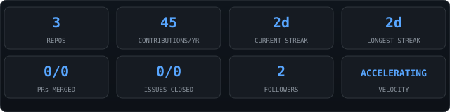
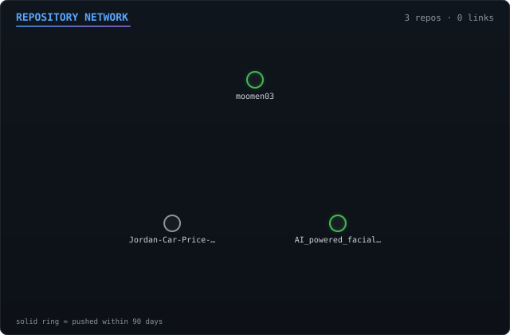
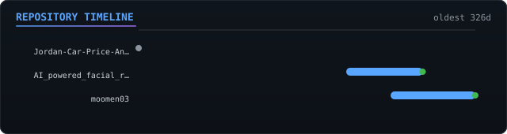
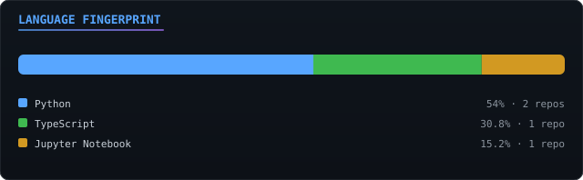
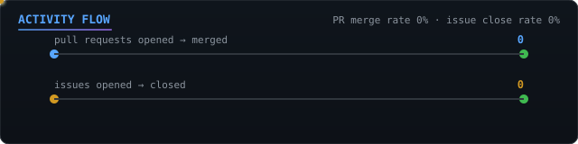

<!-- AUTO-GENERATED by scripts/render-readme.ts. Edit README.template.md, not this file. -->

# moomen03

### `LIVE ENGINEERING DASHBOARD`

<!--PANEL:SUMMARY:START-->
3 repositories tracked · 21 contributions in the last year · account age 55 months.

Primary languages: TypeScript (53.6%), Jupyter Notebook (26.5%), Python (19.9%).

Work spans 3 project clusters: TypeScript, Python, Jupyter Notebook.

Achievements: pair-extraordinaire.
<!--PANEL:SUMMARY:END-->

---

<!--PANEL:COUNTERS:START-->

<!--PANEL:COUNTERS:END-->

## Activity map
<!--PANEL:HEATMAP:START-->

<!--PANEL:HEATMAP:END-->

## Repository network
<!--PANEL:NETWORK:START-->

<!--PANEL:NETWORK:END-->

## Repository timeline
<!--PANEL:TIMELINE:START-->

<!--PANEL:TIMELINE:END-->

## Language fingerprint
<!--PANEL:LANGUAGE:START-->

<!--PANEL:LANGUAGE:END-->

## Activity flow
<!--PANEL:FLOW:START-->

<!--PANEL:FLOW:END-->

---

100% generated from this account's own GitHub data via GitHub Actions. 
No external services · no external data · no fake stats. 
Last updated 2026-09-02T11:22:51.676Z · pipeline in <code>.github/workflows/</code> + <code>scripts/</code>

© 2026 moomen03 · All Rights Reserved · <a href="./LICENSE">View-only, non-commercial license</a>

